<h1 align="center">🚀 NextHorizon: The AI Co-Pilot for Hybrid Education</h1>
<div align="center">


<h3>Reclaiming the art of teaching by automating the science of administration.</h3>
</div>

---

## 📸 Project Screenshots
| **Teacher Dashboard** | **Multimodal Grading Feedback** |
|:---:|:---:|
|  |  |
| *Real-time analytics & Quick Actions* | *Evidence-based feedback on PDFs & Videos* |

| **Smart Roll Call** | **Report Card** |
|:---:|:---:|
|  |  |
| *Instant attendance tracking & QR scan* | *Performance summaries report card according to grading* |

---

## 📖 Table of Contents
- [👋 Team Introduction](#-team-introduction)
- [🚩 Problem Statement](#-problem-statement)
- [💡 Solution Overview](#-solution-overview)
- [🧠 Idea Brainstorming & User Validation](#-idea-brainstorming--user-validation)
- [✨ Key Features](#-key-features)
- [🛠 Tech Stack](#-tech-stack)
- [🤖 Google Technology Implementation](#-google-technology-implementation)
- [🏗 Architecture](#-architecture)
- [🚧 Challenges Faced & Technical Trade-offs](#-challenges-faced--technical-trade-offs)
- [🚀 Future Roadmap & Sustainability](#-future-roadmap--sustainability)
- [💻 Installation & Setup](#-installation--setup)

---

## 👋 Team Introduction
**Team IntelliCore** We are a team of first-year Software Engineering students from **City University**, passionate about leveraging AI to solve real-world educational challenges. Our mission is to empower teachers by reclaiming the art of teaching and automating the science of administration.

---

## 🚩 Problem Statement

**The "Post-COVID" Admin Crisis**
While the world has moved to hybrid learning, the administrative workload for teachers has doubled. They are managing physical classrooms while simultaneously juggling digital submissions, online engagement, and fragmented software tools.

* **The Gap:** Students have "super-powered" AI learning aids, while teachers are stuck using fragmented, manual tools (spreadsheets, basic LMS) that don't talk to each other.
* **The Pain:** **60%** of an educator's time is lost to grading, data entry, and formatting resources—leading to severe burnout and less time for mentorship.

---

## 💡 Solution Overview

**NextHorizon** is an all-in-one AI ecosystem designed to bridge the physical and digital classroom. It acts as an active **AI Teaching Assistant** that handles the "invisible labor" of education.

> **Target SDG:** 🌍 **Goal 4: Quality Education** (Target 4.c: Increase supply of qualified teachers).

---

## 🧠 Idea Brainstorming & User Validation

Before writing a single line of code, we brainstormed solutions by directly interviewing lecturers from City University and surveying online educators. Their feedback directly shaped our core features:

* **The "Black Box" Fear:** Teachers told us, *"I don't trust an AI to grade my students if I don't know why."*
    * **Brainstorm & Iteration:** We engineered **"Glass Box Grading"**. The AI now highlights specific evidence in the student's submission (e.g., timestamps in videos or exact sentences in PDFs) to justify its score, keeping the human in the loop.
* **The Handwriting Hurdle:** Teachers noted students still submit paper exams. 
    * **Brainstorm & Iteration:** We integrated **Gemini OCR** to allow teachers to snap photos of physical, handwritten papers for instant AI grading and digitization.
* **The Format Friction:** Teachers found generic AI text useful but time-consuming to format for classes. 
    * **Brainstorm & Iteration:** We built the **Content Studio** to instantly auto-export generated lesson plans and quizzes directly to ready-to-use `.docx` and PowerPoint files.

---

## ✨ Key Features

### 🎓 For Teachers (The Admin Killer)
1.  **Multimodal "Glass Box" Grading**
    * Grades **PDFs, Docs, Images (Handwriting OCR)**, and even **YouTube Video Links**.
    * Provides transparent, evidence-based feedback (e.g., timestamps in videos, highlighted text in docs) so teachers trust the score.
2.  **AI Content Studio**
    * One-click generation of Quizzes, Lesson Plans, and Slide Decks.
    * **Auto-Export:** Downloads directly as `.docx`, `.csv` (Excel ready), and PowerPoint.
    * **Visual Aid Gen:** Uses `gemini-3-pro-image-preview` to generate accurate scientific/educational diagrams.
3.  **Live Hybrid Attendance**
    * Real-time QR code scanning for students.
    * Instant sync to teacher dashboard with manual override for connectivity issues.
4.  **Predictive Risk Dashboard**
    * Analyzes grade trends to flag "At-Risk" students before they drop out.

### 🎒 For Students
* **Study Buddy:** Auto-generate flashcards and summaries from the teacher's uploaded materials.
* **Deadline Manager:** Automated calendar syncing for assignments.

---

## 🛠 Tech Stack

| Component | Technology | Description |
| :--- | :--- | :--- |
| **Frontend** | React + Vite | Fast, responsive dashboard UI written in TypeScript. |
| **Styling** | Tailwind CSS | Modern, utility-first styling for rapid development. |
| **Auth** | Firebase Auth | Secure Google Login & Email authentication. |
| **Database** | Cloud Firestore | Real-time NoSQL database for instant attendance sync. |
| **AI Logic** | **Gemini 2.5 Flash** | Ultra-low latency model for grading & text generation. |
| **AI Creative** | **Gemini 3 Pro** | High-reasoning model for image generation & complex problem solving. |

---

## 🤖 Google Technology Implementation

| Google Tech | Implementation Details | Impact (Cause & Effect) |
| :--- | :--- | :--- |
| **Gemini 2.5 Flash** | Used via Google AI Studio SDK (`@google/genai`) for all text-based grading tasks. | **Effect:** Reduced grading latency by **40%** per student compared to Pro models, enabling "Live Feedback" during class sessions. |
| **Gemini 3 Pro** | Integrated into "Content Studio" for Image Generation. | **Effect:** Allows teachers to create copyright-free, curriculum-accurate diagrams instantly. |
| **Firebase Auth** | Implemented Google Sign-In provider. | **Effect:** Zero-friction onboarding for schools already using Google Workspace for Education. |
| **Firestore** | Real-time listeners (`onSnapshot`) for attendance data. | **Effect:** Enables the "Live QR" feature where a student's phone scan updates the projector screen instantly. |
| **Google AI Studio** | Centralized dashboard for API key provisioning and security rules. | **Effect:** Secure and isolated environment for managing model access. |

---

## 🏗 Architecture

```mermaid
flowchart TD
    Teacher[👩‍🏫 Teacher]
    Student[👨‍🎓 Student]

    subgraph NextHorizon_Client ["💻 NextHorizon Client (React + Vite)"]
        direction TB
        Dashboard[UI / Dashboard]
        
        subgraph Features
            Att["📸 Smart Roll Call\n(QR Scanner)"]
            Grade["📝 Multimodal Grading\n(PDF/Video Processor)"]
            Studio["🎨 Content Studio\n(Generator)"]
        end
        
        Export["📄 Export Engine\nDOCX/PPT/CSV"]
    end

    subgraph Google_Cloud ["☁️ Google Cloud Platform"]
        Auth[🔥 Firebase Auth]
        DB[("🔥 Firestore DB\nReal-time Sync")]
    end

    subgraph AI_Engine ["🤖 Google AI Studio"]
        SDK[Google GenAI SDK]
        
        subgraph Models
            Flash["⚡ Gemini 2.5 Flash\n(High Speed / Large Context)"]
            Pro["🧠 Gemini 3 Pro\n(Complex Reasoning / Image Gen)"]
        end
    end

    Teacher -->|Login| Auth
    Student -->|Scan QR| Att
    
    Att -->|Write Presence| DB
    DB -->|OnSnapshot Update| Dashboard

    Teacher -->|Upload PDF/Video Link| Grade
    Grade -->|Unstructured Data| SDK
    SDK -->|Grading Logic| Flash
    Flash -->|JSON Feedback| Dashboard

    Teacher -->|Request Lesson Plan| Studio
    Studio -->|Prompt| SDK
    SDK -->|Text Generation| Flash
    SDK -->|Image/Diagram Gen| Pro
    Pro -->|Visual Assets| Studio
    
    Studio -->|Raw Content| Export
    Export -->|Download File| Teacher
```


---
## 🚧 Challenges Faced & Technical Trade-offs  

- **Significant Technical Challenge:** *Scaling Firebase Auth Permissions & Security Rules.*
  - **The Problem:** We initially secured our Firestore database with strict Firebase Security Rules. However, as we rapidly added new complex features—like the Smart Roll Call and Multimodal AI Grading—we hit a massive bottleneck. The existing rules began blocking valid operations, throwing "permission denied" errors because the new features required cross-collection writes (e.g., a student scanning a QR code needing to securely update a teacher's attendance log). These strict auth blocks caused our UI to desynchronize, as the Gemini AI would finish processing, but the database writes would silently fail.  
  - **The Solution:** We completely re-architected our Firebase Security Rules from basic global checks to granular, feature-specific authorization. We implemented data-validation rules using `request.resource.data` to ensure users could only update specific authorized fields (like appending a single attendance record) without gaining full write access to the document. On the frontend, we built a custom React hook to catch these permission states, ensuring the UI only updated after the database confirmed the secure write.
  > 🔒 **View our custom security implementation:** [`firestore.rules`](https://github.com/SuYeeMyatMoe/Kita_NextHorizon_EduAiSolution/blob/main/firestore.rules)

- **Key Trade-off: Latency vs. Reasoning** To ensure "Live Feedback" during class, we made a deliberate model trade-off. We utilize **Gemini 2.5 Flash** for 90% of text-based grading to prioritize speed (cutting average grading time from 8s to <3s per submission). We reserve the heavier **Gemini 3 Pro** exclusively for complex image generation tasks where reasoning capability outweighs speed.
---

## 🚀 Future Roadmap & Sustainability  

We are building a **"Bottom-Up" SaaS model** targeting individual educators first, then institutions.

- **Phase 1: Security & Ecosystem Integration (Q3 2026)** * **Biometric Authentication:** Implement FaceID/Fingerprint biometric login for educators to ensure secure, instant access to sensitive student data and grading records.
  * **Deep LMS Integration:** Implement LTI standards to embed NextHorizon directly inside **Google Classroom** and **Canvas**.  

- **Phase 2: "Zero-Friction" Attendance (Q4 2026)** * **BLE & Pulse-Check Attendance:** Upgrade the QR Roll Call to an interactive system. The app will use Bluetooth Low Energy (BLE) proximity to ensure physical presence, while the check-in screen prompts an AI-generated "Pulse-Check" question to gauge student understanding before class starts.

- **Phase 3: Predictive Analytics (Q1 2027)** * **Predictive Student Risk:** Expand the analytics engine to flag "At-Risk" students based on grade/attendance trends before they drop out, moving from reactive grading to proactive mentorship.  

- **Phase 4: Advanced Studio & Curriculum Alignment (Q2 2027)** * **AI Syllabus Mapping & Slide Enhancement:** Upgrade the Content Studio so teachers can upload existing presentations for the AI to **improve slides directly**. The system will also feature a **Syllabus Map** to automatically align generated lessons with official curriculum standards.
---
## 💻 Installation & Setup

### 📋 Prerequisites

Make sure you have the following installed and configured:

- **Node.js** (v18 or higher)
- **Google Cloud Project** (for Firebase configuration)
- **Google AI Studio API Key** (for Gemini models)
- **Firebase Project** (Authentication, Firestore, or other services if used)

---

### 🚀 Steps to Run the Project

#### 1️⃣ Clone the Repository

```bash
git clone https://github.com/yourusername/next-horizon.git
cd next-horizon
```
#### 2️⃣ Install Dependencies
```bash
npm install
```

#### 3️⃣ Environment Configuration
Create a .env file in the root directory and add:
```bash
VITE_FIREBASE_API_KEY=your_firebase_api_key
VITE_FIREBASE_API_KEY=your_firebase_api_key
VITE_FIREBASE_AUTH_DOMAIN=your_project.firebaseapp.com
VITE_FIREBASE_PROJECT_ID=your_project_id
VITE_GEMINI_API_KEY=your_google_ai_studio_key
```
#### 4️⃣ Run the Development Server
```bash
npm run dev
```
